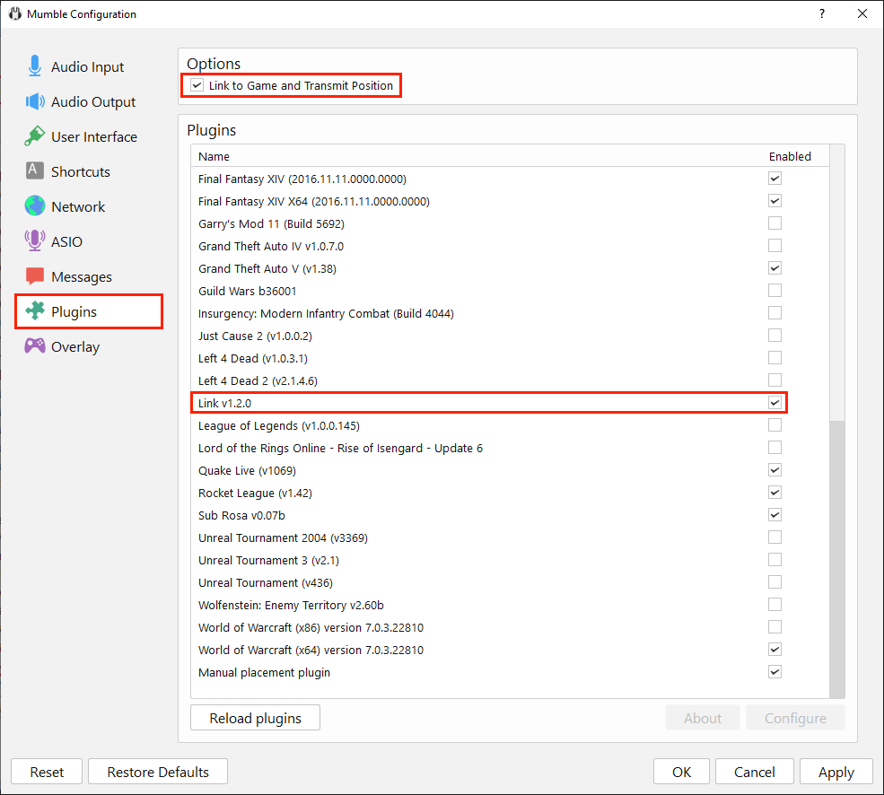
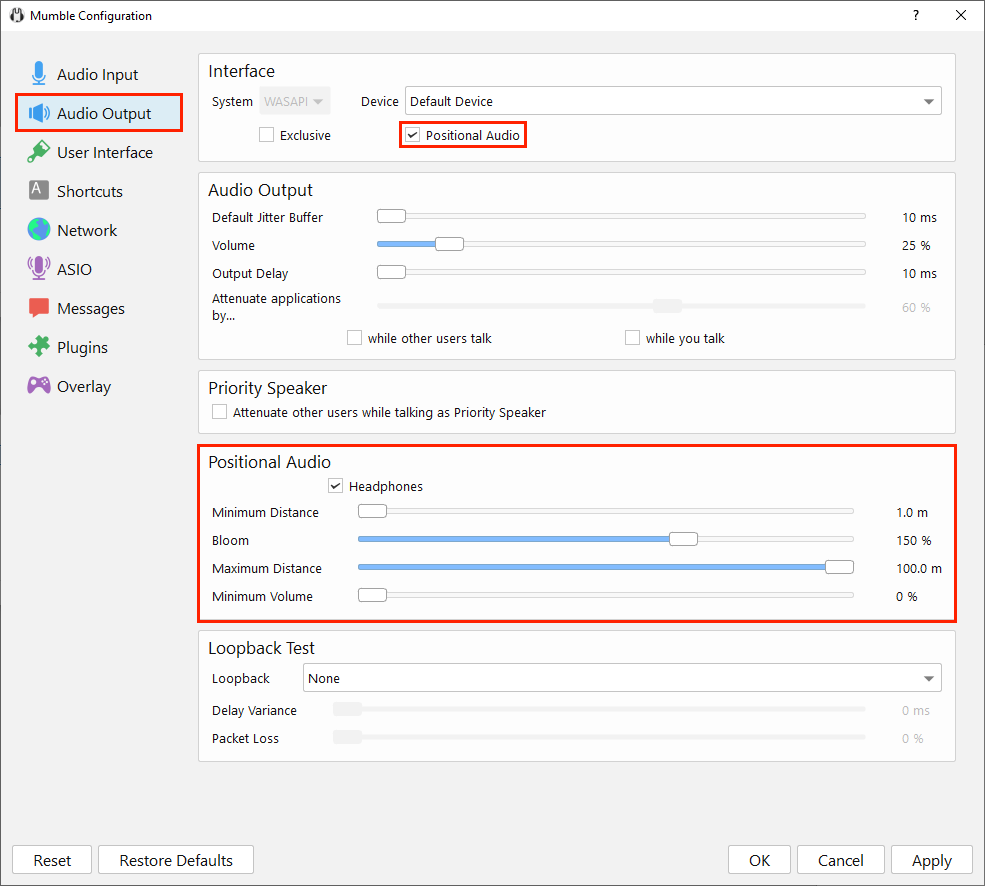

# TMumbleLink
This is a mod for Terraria using tModLoader that adds Positional Audio support through Mumble Link. This allows you to hear other players in a voice chat get louder or quieter based on position and distance.

This mod is meant to be used with the [Mumble](http://mumble.info) chat client.

Note: This mod is client-side only so you don't need to install it on a server. Also, the mod only works in multiplayer for obvious reasons.

## Requirements
* [Terraria](https://store.steampowered.com/app/105600/Terraria/)
* [tModLoader](https://store.steampowered.com/app/1281930/tModLoader/)
* [Mumble](https://mumble.info)

## Installing the Mod
The mod itself can be installed using the in-game Mod Browser.

1. Open tModLoader
2. Navigate to the Mod Browser menu
3. Search for "TMumbleLink"
4. Download the mod

## Setting up Mumble
After installing Mumble, launch the application and follow these steps to configure positional audio.

- From Mumble's starting screen, click Configure -> Settings
- Click the "Plugins" section

  - Make sure "Link to Game and Transmit Position" is checked. If it was unchecked, restart Mumble after enabling this option
  - Make sure the "Link v1.2.0" plugin is enabled
- Click the "Audio Output" section

   - Make sure the "Positional Audio" box is checked.
   - You can use the options in the Positional Audio section to control distance thresholds and volumes.

That's it for the setup! If you want to test it out, join a chat server on Mumble and also join a Terraria server.
When you join the game it should say "Mumble Linked!" in the chat and after a few seconds it should say "Terraria Linked." in the Mumble chat log.

## Compatibility with Other Mods
While I haven't explicitly tested this mod with other mods, there should not be any compatibility issues present. This section may be updated later if such an incompatibility is brought to my attention.